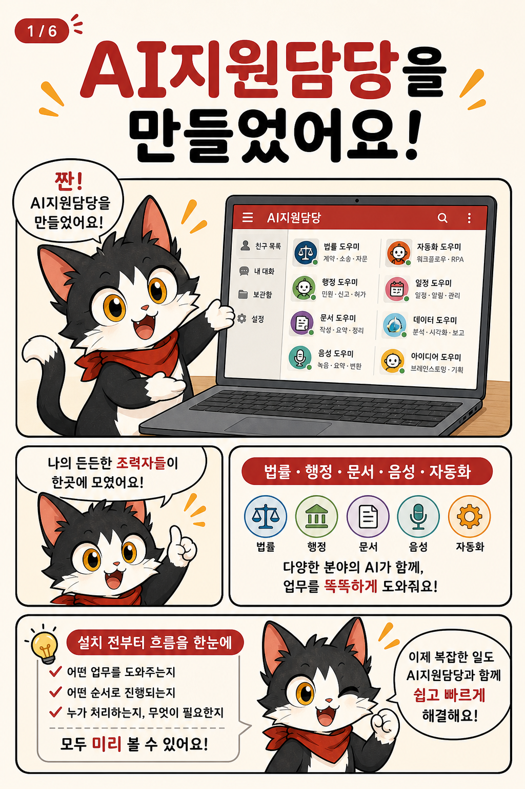
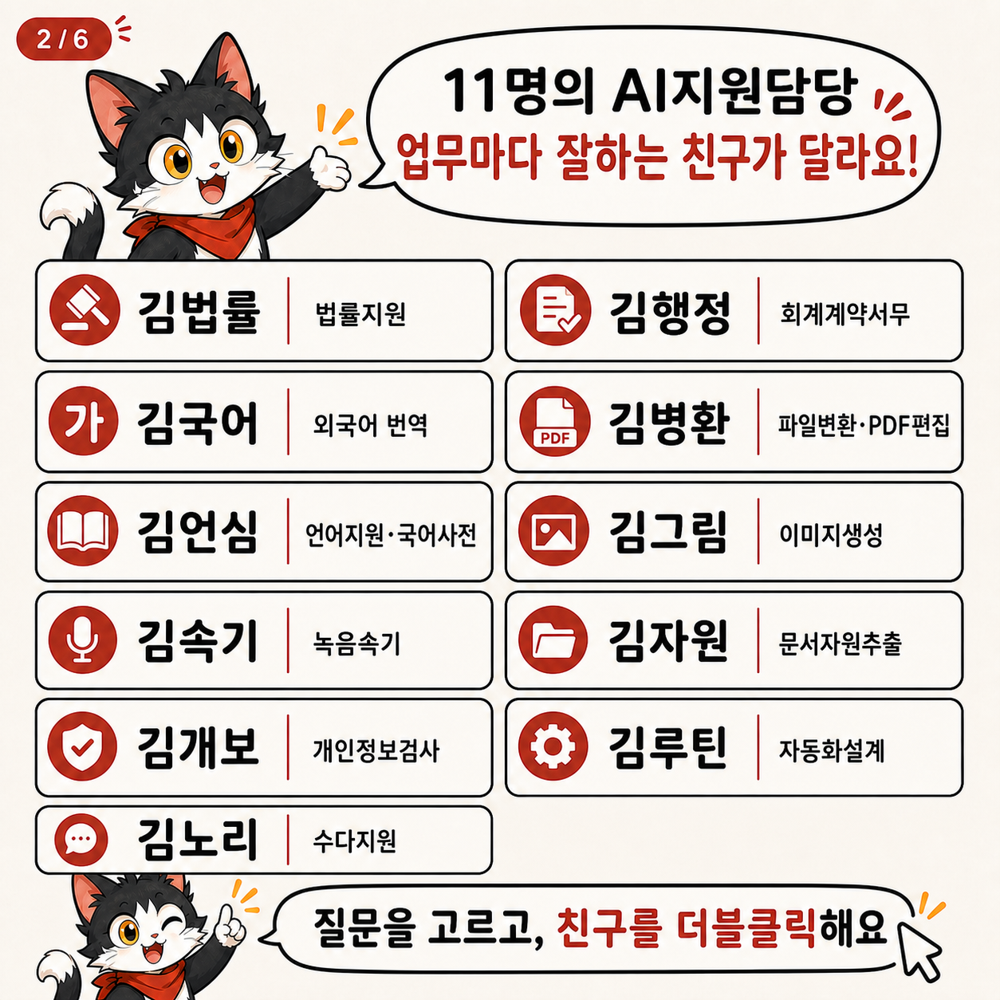
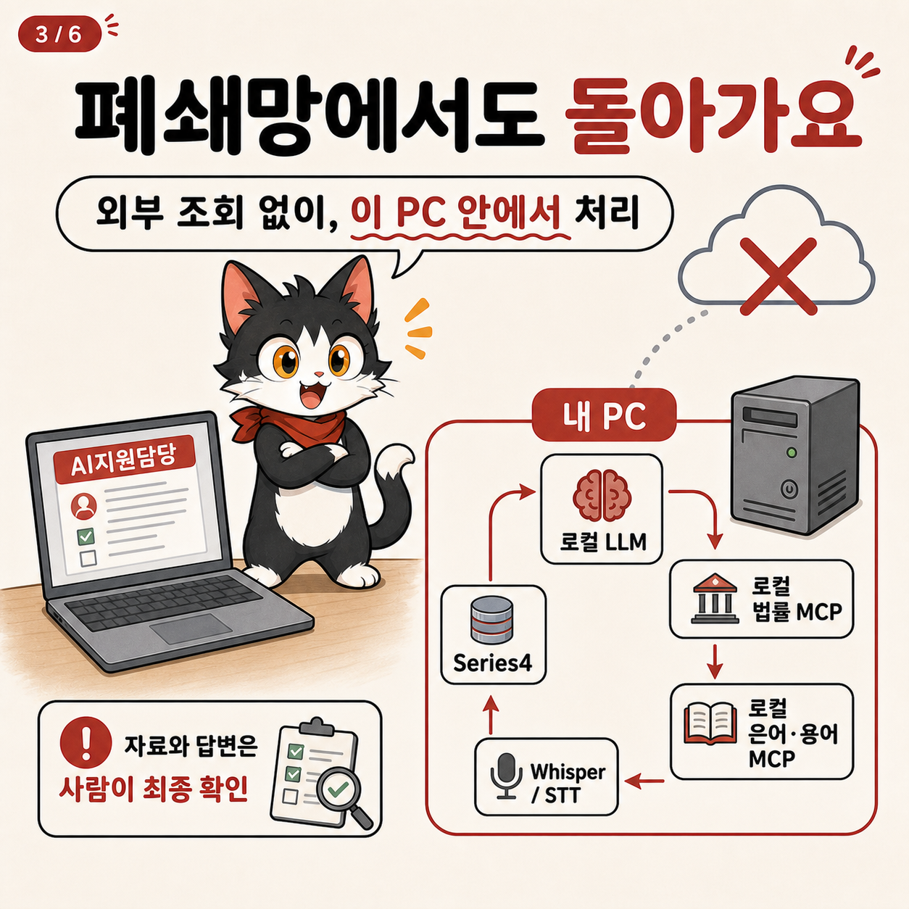
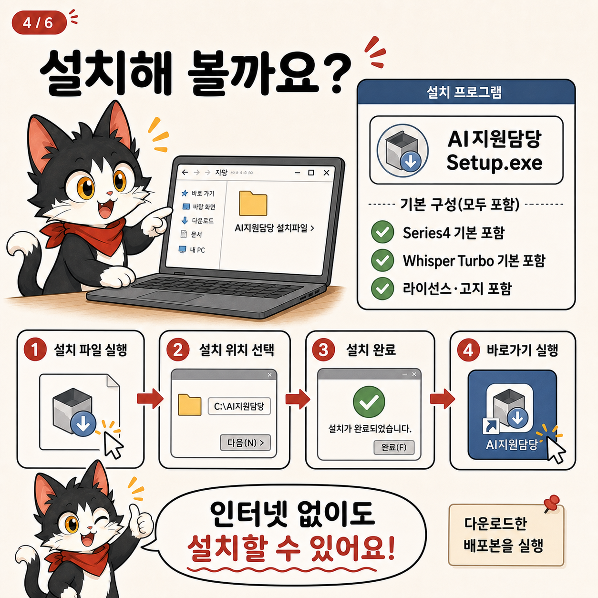
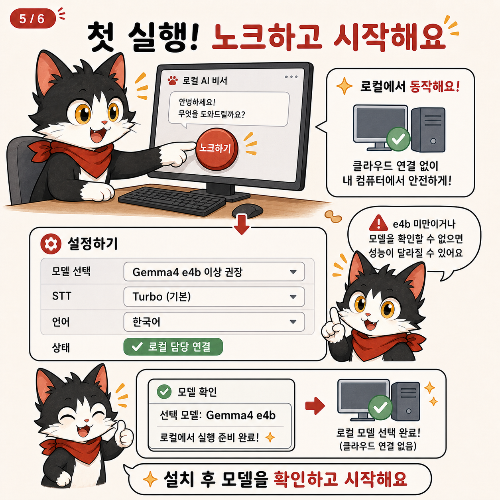

# AI지원담당 (Heyu)

> **MVP 공개본 · 설치 전에 먼저 체험하세요**
>
> [웹 데모 열기](web-demo/index.html) · [Windows 원클릭 다운로드](https://github.com/obundh/gonggong-ax-local-series-1-AISupportMessnger/releases/latest/download/AI.Setup.0.1.0.exe) · [GitLab 미러](https://gitlab.aigov.go.kr/tyui22/gonggong-ax-local-series-1-AISupportMessnger) · [소개 동영상](web-demo/assets/intro-video.mp4) · [6장 설치 만화](docs/comic/) · [만화 ZIP](https://github.com/obundh/gonggong-ax-local-series-1-AISupportMessnger/releases/latest/download/AI-Support-Messenger-Comic-6-Pages.zip)

AI지원담당은 공공기관 실무자를 위한 **로컬 우선 업무 메신저 MVP**입니다. 먼저 [웹 데모](web-demo/index.html)에서 친구목록 → 더블클릭 → 채팅 → 담당별 기능 패널의 흐름을 확인한 다음, Windows 설치파일을 내려받아 실제 로컬 환경에서 검증하세요. 웹 데모는 고정 예시만 재생하며 LLM·MCP·파일·마이크·자동화를 실행하지 않습니다.

## 고양이로 보는 AI지원담당 6장

| 1. 무엇을 만들었나 | 2. 담당자별 기능 |
| --- | --- |
|  |  |
| 3. 완전 로컬 구조 | 4. 설치 방법 |
|  |  |
| 5. 첫 실행 | 6. 사용 흐름 |
|  |  |

[만화 원본 6장 폴더 열기](docs/comic/)

GitLab에서도 [설치파일](https://gitlab.aigov.go.kr/tyui22/gonggong-ax-local-series-1-AISupportMessnger/-/releases/v0.1.0-mvp/downloads/AI.Setup.0.1.0.exe)과 [만화 6장 ZIP](https://gitlab.aigov.go.kr/tyui22/gonggong-ax-local-series-1-AISupportMessnger/-/releases/v0.1.0-mvp/downloads/AI-Support-Messenger-Comic-6-Pages.zip)을 같은 버전으로 받을 수 있습니다.

## 5분 설치 안내

1. 위의 **Windows 원클릭 다운로드**를 누릅니다. 설치파일은 GitHub Release에서 받습니다.
2. `AI.Setup.0.1.0.exe`를 실행하고 설치 위치와 바탕화면 바로가기를 선택합니다. Windows SmartScreen이 표시되면 게시자·파일 출처를 확인한 뒤 사용자의 조직 정책에 따라 허용하세요.
3. 앱을 열고 첫 화면에서 `모델` 버튼을 누릅니다. 답변용 로컬 Ollama 모델이 이 PC에 설치되어 있어야 하며 **Gemma4 e4b 이상**을 권장합니다. e2b 이하 또는 식별되지 않은 모델이면 무거운 기능의 응답이 느리거나 품질이 낮을 수 있다는 주의가 표시됩니다.
4. `노크하기`를 누른 뒤 친구목록에서 담당자를 더블클릭합니다. 질문을 보내고, 법률·행정·문서 결과는 반드시 원문과 담당자 확인 절차를 거치세요.

설치파일에는 김속기 Whisper **large-v3-turbo**와 Silero VAD, 김루틴 **Series4** 동반 프로그램이 기본 포함됩니다. `small-q5_1`은 앱의 `파일 불러와 설치` 흐름으로 검증한 파일만 추가할 수 있습니다. Ollama와 답변 모델은 설치파일에 포함되지 않으며 사용자의 로컬 환경에 별도로 준비해야 합니다.

## MVP 범위와 한계

- 법률·행정·국어·번역·PDF/문서·이미지 프롬프트·속기·개인정보 후보·반복업무 담당을 하나의 로컬 친구목록에서 엽니다.
- 김법률·김행정은 동봉된 로컬 MCP와 반입 자료를 우선하며 외부 법률 조회를 실행하지 않습니다.
- 답변은 실무 초안입니다. 법적 효력, 기관별 규정, 사건 결론, 자동 제출·결재를 보장하지 않습니다.
- 김속기는 화자분리를 제공하지 않고 고정 15분 제한 대신 기본 120MB 보호 한도를 사용합니다.
- 김그림은 로컬 그림 모델이 없으면 프롬프트만 준비합니다. 김루틴은 승인 지점과 긴급 중지를 포함하지만 좌표 자동화의 성공을 스스로 판단하지 않습니다.
- 웹 데모의 파일·녹음·생성·저장 버튼은 화면 상태만 바꾸는 모의 기능입니다.

자세한 담당별 사용법과 제한은 `docs/`, 앱의 `README` 문서, 그리고 [설치 만화](docs/comic/)를 함께 확인하세요.

공공기관 실무자를 위한 로컬 우선 Electron 업무 메신저입니다. 하나의 로컬 LLM에 법률, 행정, 번역, 문서 변환·자원 추출, 보고서, 발표자료, 이미지, 속기, 개인정보 검사, 반복업무 자동화 담당을 연결합니다.

이 저장소용 폴더는 개인정보와 로컬 작업물을 제외한 공개 소스 배포본입니다. 원본 개발 폴더와는 분리되어 있습니다.

## 포함된 것

- Electron 메인·렌더러 소스
- 로컬 Ollama 모델 조회·선택·다운로드 연결 코드
- 무결성 검증형 김속기 STT 런타임·Turbo 기본 번들 및 로컬 모델 파일 설치 관리자
- 김루틴용 Series 4 화면ㆍ입력 동시 기록 동반 프로그램 설치 관리자
- 김자원 ZIP 패키지형 문서 자원 분석·선택 저장 도구
- 법령·판례·행정자료 검색 및 MCP 서버 소스
- PDF·그래프·발표자료·개인정보 검사·자동화 도구 소스
- 데이터 동기화 및 자체 안전 샘플 생성 스크립트

## 포함되지 않은 것

- 사용자 프로필, 대화, 속기, 녹음, 업무 문서와 생성 산출물
- 법령·판례·EMP 원문 및 파생 인덱스
- API 인증값과 로컬 설정 파일
- Ollama와 이미지 생성 모델 가중치, Git에서 제외되는 Whisper 모델·런타임 바이너리
- Electron/ComfyUI/Python 설치 런타임과 Series 4 포터블 바이너리
- 권리 확인이 끝나지 않은 인물 사진과 대용량 바이너리

따라서 이 폴더는 완성 설치파일이 아니라 재현 가능한 소스 배포본입니다. GitHub의 일반 파일 크기 제한을 넘는 STT 자산은 Git에 커밋하지 않습니다. 대신 `npm run build`가 고정 URL·크기·SHA-256을 검증해 whisper.cpp 실행기, `large-v3-turbo-q5_0`, Silero VAD를 빌드 캐시에 준비하고 Windows 설치파일에 포함합니다. `small-q5_1` 등 다른 모델은 앱이 인터넷에서 받지 않으며 사용자가 선택한 검토 파일만 설치합니다.

## 기본 실행

필수 조건:

- Node.js 20 이상
- npm
- 답변 기능을 사용할 경우 로컬 Ollama와 한 개 이상의 대화 모델

Windows PowerShell:

```powershell
npm ci
npm start
```

Windows에서는 `HEYU_실행.cmd`를 더블클릭해도 됩니다. 필요한 패키지가 없으면 첫 실행 때 자동으로 `npm ci`를 수행한 뒤 앱을 엽니다.

앱 상단의 `로컬 LLM 설정` 또는 `Ollama · 모델명` 배지를 누르면 그 PC의 Ollama에 설치된 모델을 다시 읽고 사용할 모델을 선택할 수 있습니다. Ollama가 응답하지 않으면 [공식 설치 페이지](https://ollama.com/download)를, 설치된 모델이 없으면 [공식 모델 라이브러리](https://ollama.com/search)와 앱 안의 모델 받기 기능을 안내합니다. 특정 사용자 PC의 모델명이나 설치 경로를 배포본 기본값으로 사용하지 않습니다.

Linux:

```bash
npm ci
npm run start:linux
```

선택한 모델은 설치 폴더가 아니라 운영체제의 사용자별 앱 설정 폴더에 저장됩니다. `HEYU_LLM_MODEL` 환경변수가 있으면 관리자가 지정한 모델이 우선하며 화면 선택은 잠깁니다. 외부 OpenAI-compatible 서버를 사용할 때도 API 키는 파일에 넣지 말고 `HEYU_LLM_API_KEY` 환경변수로만 전달하세요.

## 김루틴 Series 4 자동화

김루틴의 `자동 설정` 탭은 Windows x64용 [gonggong-ax-local-4 Series 4](https://github.com/obundh/gonggong-ax-local-4)를 로컬 동반 프로그램으로 사용합니다. 배포 빌드는 공식 v4.1.1 포터블 ZIP 약 66MB를 고정 크기와 SHA-256으로 확인해 설치파일에 포함합니다. 사용자가 `설치`를 누르면 인터넷에 연결하지 않고 이 내장 ZIP의 위험한 경로와 링크를 다시 검사한 뒤 사용자별 앱 데이터 폴더에 원자적으로 설치합니다. 설치 자산이나 실행 경로를 화면에서 바꿀 수 없습니다.

Series 4는 별도 Windows 창에서 주 모니터 MP4와 전역 키보드ㆍ마우스 이벤트를 같은 시간축으로 기록하고, 기록된 이벤트를 좌표와 원래 간격에 따라 재생합니다. HEYU 오른쪽 패널에서는 동반 프로그램을 열고 최근 기록의 영상, 길이, 동작 종류와 시점만 검토합니다. 파일명ㆍ로컬 경로ㆍ입력 문자열ㆍ키 값은 렌더러나 채팅 LLM에 전달하지 않습니다. 최근 세션을 선택해 HEYU 안에서 다시 실행하는 기능은 제공하지 않습니다.

좌표 기반 재생은 창 위치, 주 모니터, 해상도, 배율과 팝업 변화에 취약하고 업무 성공을 의미적으로 판정하지 않습니다. OCRㆍ화면 요소 검색ㆍ조건 분기ㆍ재시도 기능도 있다고 가정하면 안 됩니다. Series 4 재생 중 `Ctrl+Shift+F12`는 전역 긴급 중지로 동작합니다. 직접 단계 편집기의 `확인 지점`과 `사용자 승인`은 실행을 실제로 멈추며 사용자가 승인하거나 거부할 때까지 다음 단계로 진행하지 않습니다.

Series 4는 개인정보 탐지ㆍ마스킹ㆍ암호화를 제공하지 않습니다. 화면과 재생용 텍스트를 포함한 입력 이벤트는 로컬 MP4ㆍJSON에 남으므로 비밀번호나 민감정보를 입력하기 전에 기록을 끝내고, `동영상` 폴더가 OneDrive 또는 조직 동기화 대상인지 확인하세요. 상세 버전ㆍ체크섬ㆍIPC 경계는 `docs/SERIES4_INTEGRATION.md`에 기록했습니다.

## 김속기 로컬 STT

Windows 설치본은 한국어 품질을 우선한 기본 구성을 포함합니다.

- 기본 포함: whisper.cpp 1.9.2 Windows x64 CPU
- 기본 포함·기본 선택: Whisper `large-v3-turbo-q5_0` 약 574MB · 한국어 회의 권장
- 기본 포함: Silero VAD 6.2.0 약 0.9MB
- 로컬 파일 선택 설치: Whisper `small-q5_1` 약 190MB · Lite·저사양·영어 음성 권장

빌드 출처, 크기와 SHA-256은 `app/main/stt-catalog.cjs`의 고정 목록만 사용합니다. 빌드는 기본 구성의 해시와 ZIP 경로를 확인한 뒤 필요한 파일만 설치본에 넣습니다. 앱은 동봉 파일도 실행 전에 다시 검증하며, 설치된 앱의 STT 네트워크 설치는 비활성화됩니다. 비동봉 모델은 메인 파일 선택창의 일회성 토큰을 거쳐 사용자별 앱 데이터 폴더로 원자적으로 설치되고 받아쓰기 자체도 로컬에서 실행됩니다. Turbo 선택 시 현재 로컬 LLM이 Gemma4 e4b 이상으로 식별되지 않으면 Lite·영어용 small 권장 주의를 표시합니다. 라이선스 전문은 설치 폴더의 `resources/licenses`에 포함됩니다.

용어집에는 기관명·사람 이름·사업명·장비명을 최대 500자까지 넣을 수 있습니다. 결과는 원문 TXT와 정리용 TXT, SRT, VTT, JSON으로 나눠 저장됩니다. 자세한 버전·체크섬·보관 정책은 `docs/STT_SETUP.md`를 확인하세요.

마이크와 가져온 녹음 파일에는 고정된 15분 제한이 없습니다. 대신 전체 WAV를 메모리에서 처리하는 현재 구조를 보호하기 위해 `녹음/STT` 용량 한도(기본 120MB)를 유지합니다. 길수록 메모리 사용량과 처리 시간이 늘어나며, 용량 한도에 가까워진 마이크 녹음은 자동 정지 후 받아쓰기를 시작합니다.

## 김자원 문서 자원 추출

김자원 화면은 HWPX, OOXML, OpenDocument, Visio, XPS/OXPS, EPUB 계열 33종의 ZIP 패키지형 문서에서 이미지·미디어·첨부·글꼴·서식·매크로·문서 구조 파일을 로컬로 분류합니다. 내부 경로와 확인 가능한 사용 위치를 보여주고, 사용자가 선택한 자원 하나 또는 전체 자원 ZIP만 새 파일로 저장합니다. 원본은 덮어쓰지 않으며 매크로·스크립트·실행 파일은 실행하지 않습니다.

이 기능은 [gonggong-ax-local-5](https://github.com/obundh/gonggong-ax-local-5)의 공개된 제품 동작과 지원 형식 설명을 참고해 HEYU 코드베이스에서 독립 구현했습니다. 해당 저장소의 소스·문서·바이너리·아트워크는 복사하거나 번들링하지 않았습니다. 원 프로젝트의 별도 [라이선스](https://github.com/obundh/gonggong-ax-local-5/blob/11997295e226ffb4bddc1715d63d18910a341f55/LICENSE)는 HEYU의 코드나 제3자 의존성 라이선스로 대체되지 않습니다.

분석은 100MB 이하 원본, 내부 항목 5,000개, 항목당 128MiB, 전체 해제 예상량 512MiB 한도 안에서 별도 작업 스레드로 수행합니다. 분할 ZIP, ZIP64, 암호화·DRM 표식, 비정상 압축률, 위험한 내부 경로는 거부합니다. 안전 미리보기는 서명과 실제 이미지 치수를 다시 확인한 1MiB 이하 정적 PNG·JPEG·WebP만 제공하며, 한 변 16,384픽셀 또는 총 2,500만 픽셀을 넘으면 저장만 허용합니다. 문서 바이트와 본문은 채팅 LLM에 자동 전달되지 않습니다.

## 법령 MCP

김법률의 실행 경로는 `tools/mcp-law` 로컬 stdio MCP만 사용합니다. 질문, 대화 이력, 검색어와 법령 원문을 국가법령정보센터나 원격 LLM으로 보내지 않습니다. 김법률은 `127.0.0.1`, `localhost` 또는 `[::1]`의 로컬 LLM만 허용하며 원격 주소가 설정되어 있으면 요청 전에 중단합니다.

국가법령정보센터 API는 **외부망에서 corpus를 준비할 때만** 사용합니다. OC는 명령행·설정 파일·앱에 넣지 않고 동기화 PowerShell의 임시 환경변수로만 제공합니다.

```powershell
$env:LAW_OC="승인된_OC"
npm run legal:official:sync -- --seed-root "C:\path\to\existing\data"
Remove-Item Env:LAW_OC
```

수집기는 현행 법령 본문, 공식 약칭, 판례·법령해석례·행정심판례·행정규칙·헌재결정례 목록을 `data` 아래에 원자적으로 저장합니다. 법령 외 참고자료의 본문은 검증된 seed와 명시된 query pack만 포함하므로, 각 `manifest.json`의 `detailCoverage`를 실제 범위로 봐야 합니다. 출처·수집시각·건수·SHA-256이 없거나 자료가 부분 수집, 손상, 해시 불일치, 설정된 최신성 기한 초과 상태이면 김법률은 해당 근거를 사용하지 않고 이유를 표시합니다.

공개 소스 Git에는 API 인증값과 corpus를 넣지 않습니다. corpus가 있는 PC에서 설치본을 만들면 `extraResources/legal-corpus`로 포함되고, 별도 반입본은 다음 명령으로 만들 수 있습니다.

```powershell
npm run mcp:law:portable
```

폐쇄망에서는 API 환경변수가 필요하지 않습니다. `legal_search`로 후보를 찾고 `law_get`으로 선택한 조문·본문을 다시 확인하며, 로컬 자료 안의 문장은 신뢰되지 않은 인용 데이터로 취급합니다. 이 사본과 국가법령정보센터 정보 자체는 법적 효력을 보장하지 않으므로 필요한 경우 관보 등 공식 원문을 우선 확인해야 합니다.

### 법령명·약칭 로컬 색인

김법률은 로컬 검색 전에 법령명 해석기를 거칩니다. `근기법`, `개보법`, `정보공개법`, `국계법`, `지계법`, `노조법` 같은 검수된 약칭과 국가법령정보센터의 공식 약칭을 정식 법령명으로 바꾸고, `노동법` 같은 분야 표현은 연차·퇴직금·단체교섭·최저임금 등 질문의 쟁점으로 대상 법령을 좁힙니다. 쟁점이 없거나 여러 후보가 남으면 임의로 한 법을 선택하지 않습니다.

별도 법령명 카탈로그가 있다면 공개 소스 작업공간에서 다음처럼 로컬 색인을 만들 수 있습니다.

```powershell
npm run legal:aliases:import -- --source "D:\legal-catalog\korea_all_legal_2026-08-16"
```

가져오기는 매니페스트에 적힌 파일 크기와 SHA-256을 확인한 뒤 `data/legal_alias/official-names.json`만 원자적으로 생성합니다. 원본 TXT, 원본 절대경로, 조문 본문은 복사하지 않습니다. 이 색인은 법령명을 확인하는 검색 라우팅 자료일 뿐 법적 근거가 아니며, 실제 답변 근거는 로컬 corpus의 본문에서 확인합니다. 제공 자료에는 원 출처 URL과 재배포 라이선스가 없으므로 생성된 전체 색인도 Git·설치본에는 포함하지 않습니다. 자세한 형식과 한계는 `tools/legal-alias/README.md`를 참고하세요.

### 로컬 법률 MCP 검사

```powershell
npm run mcp:law
npm run test:mcp:law:local
npm run test:chief:closed-network
```

제공 기능:

- Tool: `legal_search`
- Tool: `law_get`
- Resource: `legal://data/status`
- Prompt: `legal-grounded-answer`

공개 소스 저장소에는 검색 데이터를 커밋하지 않습니다. 인증값, 수집 데이터와 생성 인덱스를 소스 이력에 넣지 마세요. 배포 설치파일에는 별도로 검증한 로컬 corpus만 포함하며, 김법률과 김행정의 실행 경로는 모두 이 로컬 MCP와 로컬 행정실무 자료만 사용합니다. 수집·반입 절차는 `docs/LAW_SYNC_WORKFLOW.md`, 로컬 MCP 형식과 제한은 `tools/mcp-law/README.md`를 확인하세요.

## 공개 전 검사

```powershell
npm run verify:public
```

검사는 개인 홈 경로, 고신뢰 비밀값 패턴, 금지된 로컬 데이터 디렉터리, 대용량/모델/실행 바이너리, JavaScript 문법을 확인합니다. 자동 검사가 모든 개인정보를 판별할 수는 없으므로 새 문서·이미지·샘플은 사람이 한 번 더 확인해야 합니다.

## 데이터·라이선스

- `docs/DATA_LICENSE_AUDIT.md`
- `docs/COPYRIGHT_AUDIT_2026-05-19.md`
- `THIRD_PARTY_NOTICES.md`
- `PUBLIC_RELEASE.md`

프로젝트 자체 라이선스는 아직 선택되지 않았습니다. 공개 저장소 게시가 곧 사용·수정·재배포 허락을 의미하지 않으므로, 외부 공개나 기여 접수 전에 별도 `LICENSE`를 결정해야 합니다.
